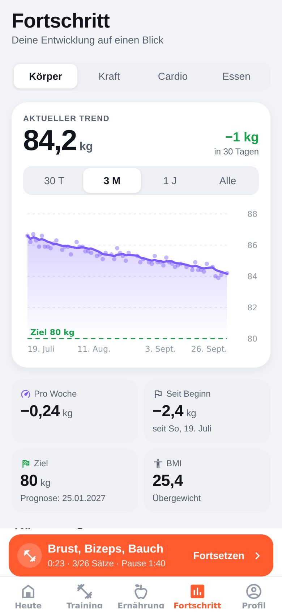
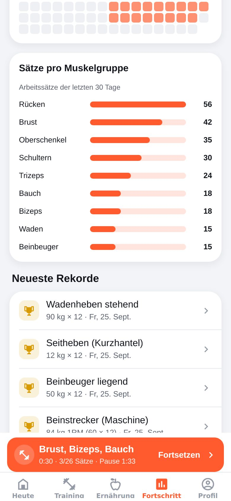
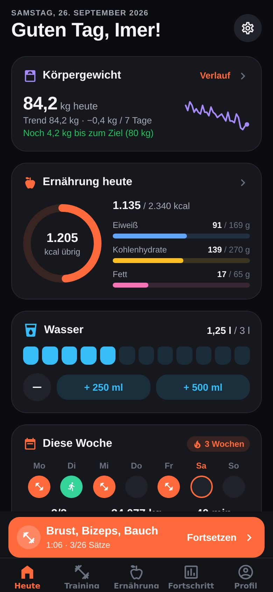

<p align="center">
  
</p>

<h1 align="center">Formkurve</h1>

<p align="center">
  Dein Trainingstagebuch für iPhone und Android – Krafttraining, tägliches Gewicht, Cardio und Ernährung.<br />
  Offline, ohne Konto, komplett auf Deutsch.
</p>

<p align="center">
  
  
  
  
</p>

---

## Die Idee

Bisher landet jedes Training in der Notizen-App:

```text
Training 25.09.
Brust, Bizeps, Bauch

Schräg-Brustmaschine
10x40kg inkl. Stange
120sek Pause
10x50kg inkl. Stange
```

Formkurve versteht genau dieses Format. Alte Notizen lassen sich **per Kopieren & Einfügen importieren** – Übungen,
Sätze, Gewichte, Pausen, „pro Seite“, „inkl./exkl. Stange“ und „links/rechts“ werden automatisch erkannt. Neue Trainings
trägst du danach schneller in der App ein als in jeder Notiz: Die Werte vom letzten Mal stehen schon da, der
Pausen-Timer läuft von selbst und neue Bestleistungen werden gefeiert. Dazu kommen tägliches Wiegen, Cardio und ein
Ernährungstagebuch – alles in einer App.

## Funktionen

### 🏋️ Krafttraining

- **Live-Training**: Sätze abhaken mit Gewicht × Wiederholungen, nur Wiederholungen (z. B. Dipbarren) oder Zeit (z. B.
  Plank), getrennt nach **links/rechts**, Satzarten Aufwärm-, Drop- und Versagenssatz, Notizen pro Übung.
- **Werte vom letzten Mal** werden vorausgefüllt, dazu ein **Steigerungs-Tipp**, wenn du zweimal dasselbe Gewicht
  sauber geschafft hast.
- **Pausen-Timer** startet automatisch nach jedem Satz (Zeit pro Übung einstellbar), mit Vibration und Mitteilung – auch
  bei gesperrtem Handy. Das Display bleibt während des Trainings an.
- **„pro Seite“ und „inkl./exkl. Stange“** wie in deinen Notizen – das Trainingsvolumen wird trotzdem korrekt berechnet.
- **Pläne** wie „Brust, Bizeps, Bauch“: selbst anlegen, aus einem Training speichern oder ein altes Training
  wiederholen.
- **Persönliche Rekorde** (Gewicht, geschätztes 1RM, Wiederholungen, Dauer) werden erkannt und mit 🏆 markiert.
- **Übungsbibliothek** mit 92 Übungen und den Gerätenamen aus dem Studio (Schräg-Brustmaschine, Butterfly, Kabel
  Crossover …) plus eigene Übungen.
- **Verlauf pro Übung** mit Diagramm (1RM, Gewicht, Volumen) und allen bisherigen Sätzen.
- **Import aus der Notizen-App** und **Teilen als Text** im selben Format. Vergessene Trainings lassen sich nachtragen
  und alte Trainings bearbeiten.

### ⚖️ Körper

- **Tägliches Gewicht** in Sekunden eintragen – mit 7-Tage-Trend (glättet Wasserschwankungen), kg pro Woche, Prognose
  für das Zielgewicht und BMI.
- **Tägliche Erinnerung** zum Wiegen zur Wunschzeit.
- **Körpermaße** (Taille, Brust, Arme, Oberschenkel … insgesamt 12 Stellen) und optional Körperfett.

### 🏃 Cardio

- 12 Aktivitäten (Laufen, Laufband, Rad, Ergometer, Crosstrainer, Rudern, Schwimmen …).
- Stoppuhr oder manuelle Eingabe, Distanz, Tempo, Geschwindigkeit und Puls.
- **Kalorienverbrauch wird automatisch geschätzt** (MET-Werte, abhängig von Tempo und Körpergewicht).

### 🥗 Ernährung

- Tagebuch nach Mahlzeiten mit **123 Grundlebensmitteln** (deutsche Durchschnittswerte), Favoriten und zuletzt
  verwendeten Lebensmitteln.
- **Barcode-Scanner** und **Online-Suche** für Markenprodukte (Daten von
  [Open Food Facts](https://world.openfoodfacts.org)).
- Eigene Lebensmittel, Portionsgrößen und **Schnelleintrag** nur mit Kalorien („Döner, 650 kcal“).
- **Kalorien- und Makroziele** werden aus Profil und Gewicht berechnet (oder manuell festgelegt).
- **Wasser-Tracker** mit Tagesziel.

### 📈 Fortschritt & Motivation

- **Heute**-Übersicht mit Schnellaktionen, Gewichtstrend, Kalorien, Wasser und Wochenübersicht.
- **Wochenserie**: Wie viele Wochen in Folge hast du dein Trainingsziel erreicht?
- Auswertungen für **Körper** (Gewicht, Maße), **Kraft** (Volumen pro Woche, Trainingskalender, Sätze pro Muskelgruppe,
  Rekorde), **Cardio** (Minuten pro Woche, nach Aktivität) und **Essen** (Kalorien, Makros, Tage im Zielbereich).

### 🔧 Außerdem

- **1RM-Rechner** mit Prozenttabelle und **Scheibenrechner** („Welche Scheiben auf die Stange?“).
- Helles und **dunkles Design** (oder automatisch wie das System).
- **Backup** als JSON-Datei, Wiederherstellung und **CSV-Export** für Excel.
- **Datenschutz**: Alle Daten liegen nur auf deinem Handy (SQLite). Kein Konto, keine Werbung, kein Tracking. Internet
  wird nur für die Produktsuche (Barcode oder Name) benötigt.

## Screenshots

| Heute                                                                                  | Training                                                                                           | Live-Training                                                                    | Trainingsdetails                                                                       |
| -------------------------------------------------------------------------------------- | -------------------------------------------------------------------------------------------------- | -------------------------------------------------------------------------------- | -------------------------------------------------------------------------------------- |
|                        |                              |  |  |
| **Übungsverlauf**                                                                      | **Ernährung**                                                                                      | **Gewicht**                                                                      | **Cardio**                                                                             |
|       |                           |              |                      |
| **Kraft-Statistik**                                                                    | **Muskelgruppen & Rekorde**                                                                        | **Profil**                                                                       | **Dunkles Design**                                                                     |
|  |  |                |        |

Weitere Bilder liegen in [`docs/screenshots`](docs/screenshots).

## Schnellstart: App auf dem eigenen Handy ausprobieren

Voraussetzungen: [Node.js](https://nodejs.org) 20 oder neuer (empfohlen 22) und die App **Expo Go** aus dem App Store
bzw. Google Play Store.

```bash
npm install
npx expo start
```

Im Terminal erscheint ein QR-Code:

- **iPhone**: QR-Code mit der Kamera-App scannen → öffnet sich in Expo Go.
- **Android**: QR-Code in Expo Go scannen.

Handy und Computer müssen im selben WLAN sein. Klappt das nicht, hilft `npx expo start --tunnel`.

> Expo Go eignet sich zum Ausprobieren. Für eine richtige, dauerhaft installierte App mit eigenem Icon siehe
> [Installation & Build](docs/installation-und-build.md).

## Als eigene App installieren

Die App wird mit [EAS Build](https://docs.expo.dev/build/introduction/) gebaut (kostenloses Expo-Konto nötig):

```bash
npx eas-cli login
npx eas-cli build -p android --profile preview     # Android: installierbare APK
npx eas-cli build -p ios --profile production      # iPhone: benötigt Apple Developer Program
npx eas-cli submit -p ios                          # → TestFlight
```

Schritt-für-Schritt-Anleitung, Alternativen ohne Apple-Entwicklerkonto und Updates:
[docs/installation-und-build.md](docs/installation-und-build.md).

## Deine Notizen importieren

1. In der Notizen-App den Text eines oder mehrerer Trainings kopieren.
2. In Formkurve **Training → Aus Notizen importieren** öffnen und **Einfügen** tippen.
3. In der Vorschau prüfen: Jede Übung wird einer Übung aus der Bibliothek zugeordnet (oder neu angelegt).
4. **Training importieren** – fertig. Die Namen werden gemerkt, der nächste Import klappt noch besser.

Welche Schreibweisen erkannt werden, steht in [docs/notizen-import.md](docs/notizen-import.md).

## Entwicklung

| Befehl              | Zweck                                                               |
| ------------------- | ------------------------------------------------------------------- |
| `npm start`         | Entwicklungsserver starten (QR-Code für Expo Go)                    |
| `npm run ios`       | im iOS-Simulator öffnen (nur macOS mit Xcode)                       |
| `npm run android`   | im Android-Emulator oder auf einem per USB verbundenen Gerät        |
| `npm run web`       | Web-Vorschau im Browser (zum schnellen Ausprobieren der Oberfläche) |
| `npm test`          | Unit- und Datenbanktests (Jest)                                     |
| `npm run typecheck` | TypeScript prüfen                                                   |
| `npm run lint`      | ESLint (inkl. React-Compiler-Regeln)                                |
| `npm run format`    | Code mit Prettier formatieren                                       |
| `npm run check`     | alles zusammen: Typen, Lint, Formatierung, Tests                    |

Mehr dazu in [docs/entwicklung.md](docs/entwicklung.md).

### Technik

- [Expo](https://expo.dev) SDK 57 · React Native 0.86 · React 19 · TypeScript · React Compiler
- [Expo Router](https://docs.expo.dev/router/introduction/) (dateibasierte Navigation, Tabs)
- SQLite auf dem Gerät ([expo-sqlite](https://docs.expo.dev/versions/latest/sdk/sqlite/)), in der Web-Vorschau
  [sql.js](https://sql.js.org)
- [Zustand](https://github.com/pmndrs/zustand) für App-Zustand (laufendes Training, Timer, Einstellungen)
- Eigene Diagramme mit [react-native-svg](https://github.com/software-mansion/react-native-svg)
- Lokale Mitteilungen, Haptik, Kamera (Barcode), Teilen, Dateiexport über Expo-Module

### Projektstruktur

```text
src/
├── app/          Bildschirme (Expo Router): Tabs, Training, Übungen, Ernährung, Körper, Einstellungen …
├── components/   größere UI-Bausteine (Satzzeile, Übungskarte, Pausen-Timer, Diagramme …)
├── ui/           Design-System: Farben, Text, Buttons, Eingabefelder, Listen, Dialoge, Diagramme
├── domain/       reine Logik ohne UI: Notizen-Parser, 1RM, Trend, Kalorien, Formatierung
├── db/           SQLite: Schema/Migrationen, Startdaten (Übungen, Lebensmittel), Repositories
├── state/        Zustand-Stores: Einstellungen, laufendes Training, Pausen- und Cardio-Timer
├── services/     Plattformdienste: Mitteilungen, Haptik, Dateien, Open Food Facts
├── features/     Abläufe über mehrere Schichten (Training starten, Training teilen)
└── __tests__/    Tests für Parser, Berechnungen, Open Food Facts und Datenbank
docs/             Dokumentation und Screenshots
```

## Dokumentation

| Dokument                                               | Inhalt                                                       |
| ------------------------------------------------------ | ------------------------------------------------------------ |
| [Benutzerhandbuch](docs/benutzerhandbuch.md)           | alle Funktionen der App Schritt für Schritt                  |
| [Notizen-Import](docs/notizen-import.md)               | unterstütztes Textformat mit Beispielen                      |
| [Installation & Build](docs/installation-und-build.md) | App auf iPhone und Android installieren, Builds, Updates     |
| [Berechnungen](docs/berechnungen.md)                   | Formeln: 1RM, Volumen, Gewichtstrend, Kalorienbedarf, Cardio |
| [Architektur](docs/architektur.md)                     | Aufbau des Codes, Datenbankschema, Datenfluss                |
| [Entwicklung](docs/entwicklung.md)                     | Tests, Konventionen, neue Übungen/Lebensmittel, Migrationen  |
| [Roadmap](docs/roadmap.md)                             | Ideen für kommende Versionen                                 |

## Hinweise

- Kalorien, Nährwerte, 1RM und Kalorienverbrauch sind **Schätzwerte** und ersetzen keine ärztliche oder
  ernährungswissenschaftliche Beratung.
- Produktdaten aus dem Barcode-Scanner stammen von [Open Food Facts](https://world.openfoodfacts.org) und stehen unter
  der [Open Database License](https://opendatacommons.org/licenses/odbl/1-0/).
- Alle Daten bleiben auf dem Gerät. Vor einem Handywechsel am besten unter **Profil → Backup, Export &
  Wiederherstellung → Backup exportieren** eine Sicherung anlegen.
