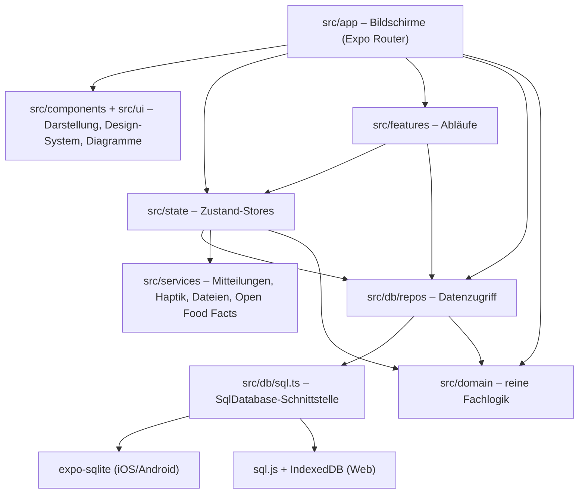

# Architektur

Formkurve ist eine Offline-first-App: Alle Daten liegen in einer SQLite-Datenbank auf dem Gerät, es gibt keinen Server
und kein Konto. Der Code ist in klar getrennte Schichten aufgeteilt, damit die Fachlogik ohne Handy testbar bleibt.

## Technologie

| Bereich          | Technik                                                                                                                              |
| ---------------- | ------------------------------------------------------------------------------------------------------------------------------------ |
| Framework        | Expo SDK 57, React Native 0.86, React 19, TypeScript (strict), React Compiler                                                        |
| Navigation       | Expo Router (Dateien in `src/app` = Bildschirme), Tabs + Stack, typisierte Routen                                                    |
| Datenbank        | expo-sqlite (iOS/Android), sql.js mit IndexedDB (Web-Vorschau), sql.js (Tests)                                                       |
| Zustand          | Zustand-Stores für Einstellungen, laufendes Training, Timer und UI                                                                   |
| Diagramme        | eigene Komponenten auf Basis von react-native-svg                                                                                    |
| Gerätefunktionen | expo-notifications, expo-haptics, expo-keep-awake, expo-camera, expo-file-system, expo-sharing, expo-document-picker, expo-clipboard |
| Qualität         | Jest (jest-expo), ESLint (eslint-config-expo inkl. React-Compiler-Regeln), Prettier                                                  |

## Schichten



| Ordner           | Aufgabe                                                                                                                                                                                                                                                       |
| ---------------- | ------------------------------------------------------------------------------------------------------------------------------------------------------------------------------------------------------------------------------------------------------------- |
| `src/domain`     | Reine TypeScript-Funktionen ohne React und ohne Datenbank: Typen, Notizen-Parser und -Formatierer, 1RM, Volumen, Rekorde, Gewichtstrend, Kalorienbedarf, MET, Datums- und Zahlenformatierung (deutsch), Beschriftungen. Vollständig mit Unit-Tests abgedeckt. |
| `src/db`         | Datenbankzugriff: Schnittstelle, Plattform-Adapter, Migrationen, Startdaten, Änderungs-Events, `useQuery`-Hook und Repositories (`repos/`).                                                                                                                   |
| `src/state`      | Zustand-Stores: `settings` (Profil, Ziele, Einstellungen), `activeWorkout` (laufendes Training), `restTimer`, `cardioTimer`, `ui` (Toasts, Übungsauswahl).                                                                                                    |
| `src/services`   | Kapselung von Gerätefunktionen: lokale Mitteilungen, Haptik, Dateien teilen/öffnen, Open-Food-Facts-Abfrage.                                                                                                                                                  |
| `src/features`   | Abläufe über mehrere Schichten, z. B. „Training aus Plan starten“ oder „Training als Text teilen“.                                                                                                                                                            |
| `src/ui`         | Design-System: Farben (hell/dunkel), Typografie, Buttons, Eingabefelder, Listen, Sheets, Dialoge, Diagramme.                                                                                                                                                  |
| `src/components` | Fachliche UI-Bausteine: Satzzeile, Übungskarte, Pausen-Timer-Leiste, Trainingsdetails, Gewichtsdiagramm …                                                                                                                                                     |
| `src/app`        | Bildschirme. Jede Datei ist eine Route.                                                                                                                                                                                                                       |
| `src/dev`        | Beispieldaten für die Web-Vorschau (nur Web, nicht in den Handy-Apps enthalten).                                                                                                                                                                              |

**Regel:** Abhängigkeiten zeigen nur nach unten. `domain` kennt weder React noch die Datenbank; Repositories kennen kein
React; Bildschirme greifen über Repositories, Stores und Features auf Daten zu.

## Start der App

[`src/app/_layout.tsx`](../src/app/_layout.tsx) führt beim Start nacheinander aus:

1. Splash-Screen festhalten.
2. Datenbank öffnen (`openDatabase`) – auf iOS/Android mit expo-sqlite (WAL-Modus, Fremdschlüssel aktiv), im Web mit
   sql.js.
3. `initializeDatabase`: [Migrationen](#migrationen) ausführen und [Startdaten](#startdaten) einspielen.
4. Einstellungen und ein eventuell laufendes Training aus der Datenbank laden.
5. Mitteilungen konfigurieren (Android-Kanäle „Pausen-Timer“ und „Erinnerungen“).
6. Splash-Screen ausblenden. Ist die Einrichtung noch nicht abgeschlossen, wird zum Onboarding weitergeleitet.

## Datenbank

### Plattform-Adapter

Alle Repositories sprechen nur die kleine Schnittstelle `SqlDatabase` aus [`src/db/sql.ts`](../src/db/sql.ts)
(`execAsync`, `runAsync`, `getAllAsync`, `getFirstAsync`, `withTransactionAsync`). Metro wählt die Implementierung über
die Dateiendung:

| Datei                | Plattform     | Umsetzung                                                                            |
| -------------------- | ------------- | ------------------------------------------------------------------------------------ |
| `src/db/open.ts`     | iOS, Android  | expo-sqlite, Datei `formkurve.db` im App-Container                                   |
| `src/db/open.web.ts` | Web           | sql.js (asm.js-Build), Datenbankdatei wird verzögert (500 ms) in IndexedDB gesichert |
| `src/db/sqljs.ts`    | Web und Tests | Adapter von sql.js auf `SqlDatabase`                                                 |

Die Tests verwenden denselben sql.js-Adapter mit einer frischen In-Memory-Datenbank
([`src/__tests__/helpers/testDb.ts`](../src/__tests__/helpers/testDb.ts)) – dadurch laufen Migrationen, Startdaten und
Repositories in Jest wie auf dem Gerät.

### Schema

Konventionen: IDs sind zufällige Strings, Zeitpunkte sind Millisekunden seit 1970 (`INTEGER`), Kalendertage sind
lokale Datumsangaben `YYYY-MM-DD` (`TEXT`), Gewichte in kg, Dauern in Sekunden, Listen als JSON-Text.

| Tabelle              | Inhalt                                                                                                                                                                                                                                                |
| -------------------- | ----------------------------------------------------------------------------------------------------------------------------------------------------------------------------------------------------------------------------------------------------- |
| `kv`                 | Schlüssel-Wert-Speicher (JSON): Einstellungen, laufendes Training, Seed-Version                                                                                                                                                                       |
| `exercises`          | Übungen: Name, Muskelgruppe (+ sekundäre), Gerät, Erfassung (`weight_reps`/`reps`/`time`), Gewichtsangabe (`total`/`per_side`), Stange (`none`/`included`/`excluded`) und Stangengewicht, einseitig, Pausenzeit, alternative Namen, eigene/archiviert |
| `workouts`           | Trainings: Titel, Beginn, Ende, Notizen, Plan, Quelle (`app`/`import`)                                                                                                                                                                                |
| `workout_exercises`  | Übungen eines Trainings mit Reihenfolge, Pausenzeit und Notiz (löscht sich mit dem Training)                                                                                                                                                          |
| `workout_sets`       | Sätze: Reihenfolge, Wiederholungen, Gewicht, Dauer, Seite, Satzart, RPE, Pause, Notiz                                                                                                                                                                 |
| `templates`          | Pläne: Name, Notizen, Reihenfolge, zuletzt verwendet                                                                                                                                                                                                  |
| `template_exercises` | Übungen eines Plans mit Pausenzeit und Sätzen (JSON)                                                                                                                                                                                                  |
| `body_weights`       | Körpergewicht pro Tag (Primärschlüssel: Datum), optional Körperfett                                                                                                                                                                                   |
| `measurements`       | Körpermaße: Datum, Messstelle, Wert (eindeutig pro Datum und Messstelle)                                                                                                                                                                              |
| `cardio_sessions`    | Cardio: Art, Beginn, Dauer, Distanz, kcal, Puls, Notizen                                                                                                                                                                                              |
| `foods`              | Lebensmittel: Nährwerte pro 100 g/ml, Portion, Barcode, Quelle (`builtin`/`custom`/`off`), Favorit, Nutzungszähler                                                                                                                                    |
| `food_entries`       | Ernährungstagebuch: Datum, Mahlzeit, Menge und die berechneten Nährwerte (Kopie, damit spätere Änderungen am Lebensmittel alte Einträge nicht verändern)                                                                                              |
| `water_log`          | Wasser in ml pro Tag                                                                                                                                                                                                                                  |

Die vollständige Definition steht in [`src/db/migrations.ts`](../src/db/migrations.ts).

### Migrationen

Die Schema-Version steht in `PRAGMA user_version`. [`migrations.ts`](../src/db/migrations.ts) enthält eine Liste von
SQL-Skripten; beim Start werden alle noch fehlenden Skripte in je einer Transaktion ausgeführt. Freigegebene Migrationen
werden nie geändert, sondern es wird ein neuer Eintrag angehängt. Ist die Datenbank neuer als die App (z. B. nach einem
Downgrade), bricht der Start mit einer verständlichen Meldung ab, statt Daten zu beschädigen.

### Startdaten

[`src/db/seed`](../src/db/seed) enthält 92 Übungen (mit deutschen Studio-Gerätenamen als alternativen Namen) und
123 Grundlebensmittel. Sie werden mit `INSERT OR IGNORE` eingespielt – Änderungen der Nutzerin oder des Nutzers an
eingebauten Einträgen bleiben erhalten. `SEED_VERSION` steuert, ob beim Start neue Einträge ergänzt werden müssen.

### Repositories und Aktualisierung der Oberfläche

Jeder Bereich hat ein Repository in [`src/db/repos`](../src/db/repos) (`workouts`, `exercises`, `templates`, `body`,
`cardio`, `nutrition`, `stats`, `backup`, `importNotes`, `kv`). Repositories wandeln Zeilen in Domänenobjekte um und
melden nach jedem Schreibzugriff die betroffenen Bereiche über einen kleinen Event-Bus
([`events.ts`](../src/db/events.ts)).

Bildschirme lesen Daten mit dem Hook [`useQuery`](../src/db/useQuery.ts):

```tsx
const weights = useQuery(() => listWeights(from), [from], ['weights']);
```

Der Hook führt die Abfrage aus, wenn sich die Abhängigkeiten ändern **oder** ein Schreibzugriff einen der angegebenen
Bereiche (`'weights'`) betrifft. Mehrere Schreibzugriffe in Folge lösen nur eine Aktualisierung aus. So bleiben alle
Anzeigen – etwa „Heute“ und „Fortschritt“ – ohne globalen Cache automatisch aktuell.

## Laufendes Training

Das laufende Training ist ein Entwurf im Store [`activeWorkout`](../src/state/activeWorkout.ts):

- Eingaben werden als Text gehalten (Komma-Dezimalzahlen, leere Felder), dazu pro Satz die Vorschlagswerte vom letzten
  Mal, die Bestwerte der Übung (für die Rekorderkennung) und der Steigerungs-Tipp.
- Jede Änderung wird nach 400 ms in der Tabelle `kv` gesichert. Wird die App beendet oder vom System geschlossen, geht
  nichts verloren.
- **Satz abhaken**: leere Felder werden mit den Vorschlagswerten gefüllt, die Werte gegen die Bestwerte geprüft (Toast
  bei Rekord), der Pausen-Timer gestartet und eine haptische Rückmeldung ausgelöst.
- **Beenden** schreibt Training, Übungen und Sätze in einer Transaktion (`saveWorkout`) und leert den Entwurf. Beim
  Bearbeiten eines alten Trainings wird derselbe Entwurf verwendet und das Training ersetzt.

Der **Pausen-Timer** ([`restTimer.ts`](../src/state/restTimer.ts)) speichert den Endzeitpunkt statt eines Zählers. Damit
stimmt die Anzeige auch, nachdem die App im Hintergrund war. Zusätzlich wird eine lokale Mitteilung zum Endzeitpunkt
geplant und beim Überspringen oder Verändern der Pause neu geplant bzw. gelöscht.

## Plattformunterschiede

| Funktion        | iOS / Android                                   | Web-Vorschau                                                                                       |
| --------------- | ----------------------------------------------- | -------------------------------------------------------------------------------------------------- |
| Datenbank       | expo-sqlite                                     | sql.js + IndexedDB                                                                                 |
| Mitteilungen    | expo-notifications (lokal)                      | nicht verfügbar (`notifications.web.ts`)                                                           |
| Dialoge         | native Alert-Dialoge                            | eigene Dialog-Komponente (`DialogHost`)                                                            |
| Dateien         | expo-file-system + Teilen-Menü, Document Picker | Download im Browser, Dateiauswahl                                                                  |
| Barcode-Scanner | expo-camera                                     | Kamera je nach Browser, sonst manuelle Eingabe                                                     |
| Beispieldaten   | –                                               | `window.__formkurveDemo()` (siehe [Entwicklung](entwicklung.md#beispieldaten-in-der-web-vorschau)) |

## Backup-Format

Ein Backup ist eine JSON-Datei:

```json
{
  "app": "formkurve",
  "format": 1,
  "schemaVersion": 1,
  "exportedAt": "2026-09-26T08:00:00.000Z",
  "tables": {
    "exercises": [{ "id": "ex-lat-pulldown", "name": "Latzug breit", "...": "..." }],
    "workouts": [],
    "workout_sets": []
  }
}
```

Beim Wiederherstellen wird die Datei geprüft (App, Format, Schema-Version, bekannte Tabellen), dann werden in einer
Transaktion alle Tabellen geleert und die Zeilen eingefügt. Unbekannte Spalten werden ignoriert, sodass auch Backups
älterer Versionen eingespielt werden können; anschließend werden fehlende Startdaten ergänzt. Code:
[`src/db/repos/backup.ts`](../src/db/repos/backup.ts).

## Datenschutz

- Keine Konten, keine Server, keine Analyse- oder Werbedienste.
- Die einzige Netzwerkverbindung ist die Produktsuche bei Open Food Facts – übertragen wird nur der Barcode bzw. der
  Suchbegriff.
- Mitteilungen sind lokal geplant, es werden keine Push-Tokens erzeugt.
