# Benutzerhandbuch

Dieses Handbuch beschreibt alle Funktionen von Formkurve. Die App ist in fünf Bereiche (Tabs am unteren Rand)
gegliedert: **Heute**, **Training**, **Ernährung**, **Fortschritt** und **Profil**.

## Inhalt

1. [Erste Schritte](#1-erste-schritte)
2. [Heute](#2-heute)
3. [Krafttraining](#3-krafttraining)
4. [Notizen importieren](#4-notizen-importieren)
5. [Körpergewicht und Körpermaße](#5-körpergewicht-und-körpermaße)
6. [Cardio](#6-cardio)
7. [Ernährung und Wasser](#7-ernährung-und-wasser)
8. [Fortschritt](#8-fortschritt)
9. [Profil und Einstellungen](#9-profil-und-einstellungen)
10. [Werkzeuge](#10-werkzeuge)
11. [Daten sichern, exportieren und löschen](#11-daten-sichern-exportieren-und-löschen)
12. [Tipps und häufige Fragen](#12-tipps-und-häufige-fragen)

---

## 1. Erste Schritte

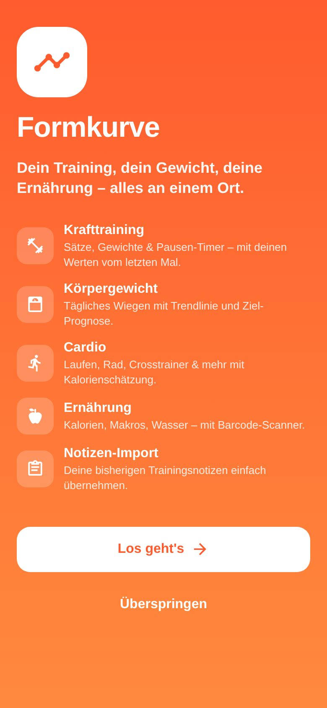

Beim ersten Start führt dich die App durch drei kurze Schritte:

1. **Erzähl uns von dir** – Vorname, Geschlecht, Geburtsjahr, Größe und wie aktiv du im Alltag bist.
2. **Gewicht & Ziel** – aktuelles Gewicht, optional ein Zielgewicht und dein Ziel (Abnehmen, Gewicht halten,
   Muskelaufbau).
3. **Fast geschafft** – die App schlägt dir daraus Kalorien- und Makroziele vor. Außerdem legst du fest, wie oft du pro
   Woche trainieren möchtest.

Mit **Fertig & Notizen importieren** landest du direkt beim [Import](#4-notizen-importieren) deiner alten
Trainingsnotizen. Alle Angaben sind freiwillig („Überspringen“ bzw. „Später“) und lassen sich jederzeit unter
**Profil** ändern. Ohne Größe, Geburtsjahr und Gewicht kann die App allerdings keine Kalorienziele berechnen.

 

## 2. Heute

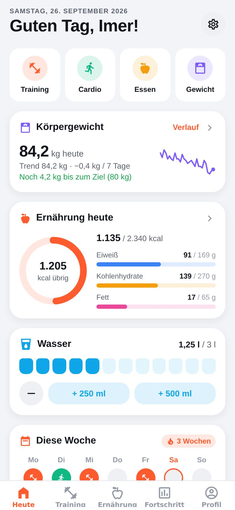

Die Startseite zeigt auf einen Blick, was heute wichtig ist:

- **Schnellaktionen**: Training starten, Cardio, Essen oder Gewicht eintragen.
- **Gewicht**: letzter Eintrag, 7-Tage-Trend und Mini-Verlauf. Wurde heute noch nicht gewogen, kannst du es direkt
  nachholen.
- **Ernährung heute**: Kalorien und Makros im Vergleich zu deinem Ziel.
- **Wasser**: mit einem Tipp 250 ml oder 500 ml hinzufügen.
- **Diese Woche**: Trainings- und Cardiotage (Mo–So), Anzahl Trainings gegenüber deinem Wochenziel, Volumen und
  Cardio-Minuten. Das 🔥 zeigt deine **Wochenserie** – wie viele Wochen in Folge du dein Trainingsziel erreicht hast.
- **Letztes Training** – ein Tipp öffnet die Details.

Solange ein Training läuft, erscheint über der Tab-Leiste eine orangefarbene Leiste mit Dauer, Sätzen und
Pausen-Timer. Ein Tipp darauf bringt dich zurück ins Training.

 

## 3. Krafttraining

### 3.1 Training starten

Im Tab **Training** gibt es drei Wege:

- **Leeres Training starten** und Übungen nach und nach hinzufügen.
- **Plan starten** – unter „Meine Pläne“ auf **Starten** tippen. Alle Übungen des Plans sind bereits eingetragen.
- **Erneut trainieren** – im Verlauf ein altes Training öffnen und über das Menü (⋯) wiederholen.

Der Titel des Trainings (z. B. „Brust, Bizeps, Bauch“) ergibt sich automatisch aus den trainierten Muskelgruppen,
solange du keinen eigenen eingibst.

 

### 3.2 Sätze eintragen

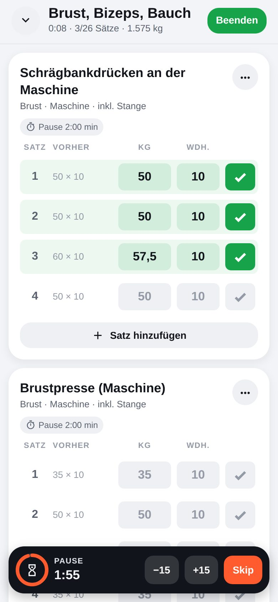

Jede Übung erscheint als Karte mit einer Zeile pro Satz:

| Element              | Bedeutung                                                                          |
| -------------------- | ---------------------------------------------------------------------------------- |
| **Satznummer**       | Tippen öffnet die Satzoptionen (Satzart ändern, Satz löschen)                      |
| **Vorher**           | was du beim letzten Mal in diesem Satz geschafft hast; Tippen übernimmt die Werte  |
| **kg / Wdh. / Sek.** | deine Werte – je nach Übung Gewicht × Wiederholungen, nur Wiederholungen oder Zeit |
| **L / R**            | bei einseitigen Übungen die Seite; Tippen wechselt zwischen links und rechts       |
| **✓**                | Satz abhaken – startet den Pausen-Timer und prüft auf neue Rekorde                 |

- Grau vorausgefüllte Werte stammen vom letzten Training. **Hast du genau das wieder geschafft, reicht der Haken** – die
  grauen Werte werden übernommen.
- Neben dem Übungsnamen erscheint ein **Steigerungs-Tipp** (z. B. „Zeit für 42,5 kg?“), wenn du in den letzten beiden
  Trainings dasselbe Höchstgewicht mit mindestens gleich vielen Wiederholungen geschafft hast.
- **Satz hinzufügen** schlägt die Werte vom letzten Mal vor – gibt es keine, die des vorherigen Satzes.
- Die Angabe „pro Seite“ bzw. „inkl./exkl. Stange“ wird an der Übung angezeigt. Du trägst das Gewicht genauso ein, wie du
  es bisher notiert hast – das Volumen rechnet die App korrekt um.

**Satzarten** (über die Satznummer):

| Satzart          | Kürzel | Wirkung                                                        |
| ---------------- | ------ | -------------------------------------------------------------- |
| Arbeitssatz      | –      | normaler Satz                                                  |
| Aufwärmsatz      | W      | zählt nicht für Rekorde und nicht für „Sätze pro Muskelgruppe“ |
| Dropsatz         | D      | Markierung für reduzierte Gewichte direkt im Anschluss         |
| Bis zum Versagen | V      | Markierung für Sätze bis zum Muskelversagen                    |

 

### 3.3 Pausen-Timer

Nach jedem abgehakten Satz startet der Pausen-Timer mit der Pausenzeit der Übung (Standard 90 Sekunden, änderbar über
das Uhr-Symbol an der Übung oder in den Übungseinstellungen).

- **−15 / +15** verkürzt bzw. verlängert die Pause, **Skip** beendet sie.
- Am Ende vibriert das Handy. Ist die App im Hintergrund oder das Handy gesperrt, kommt eine **Mitteilung** (einmalig
  erlauben, wenn die App fragt).
- Während des Trainings bleibt das Display an (abschaltbar unter Profil → „Bildschirm aktiv halten“).

### 3.4 Übungen im Training verwalten

- **Übung hinzufügen** öffnet die Bibliothek. Du kannst mehrere Übungen auf einmal auswählen.
- Das Menü **⋯** an einer Übung bietet: Pausenzeit ändern, Notiz, Übung ersetzen, nach oben/unten verschieben, Verlauf
  & Rekorde ansehen und Übung entfernen.
- Oben kannst du **Datum, Beginn und Dauer** anpassen – praktisch, wenn du ein Training nachträglich einträgst.

### 3.5 Training beenden

- **Beenden** speichert das Training. Hast du Werte eingetragen, aber nicht abgehakt, fragt die App, ob diese Sätze
  mitgespeichert oder verworfen werden sollen.
- Der Pfeil nach unten (oben links) **minimiert** das Training – es läuft weiter, auch wenn du die App schließt.
- **Training verwerfen** (ganz unten) löscht das laufende Training.

Danach folgt die **Zusammenfassung** mit Dauer, Übungen, Sätzen, Volumen und neuen Rekorden. Von hier aus kannst du das
Training **als Plan speichern** oder **als Text teilen** – im Format deiner Notizen, z. B. für WhatsApp oder die
Notizen-App.

### 3.6 Rekorde

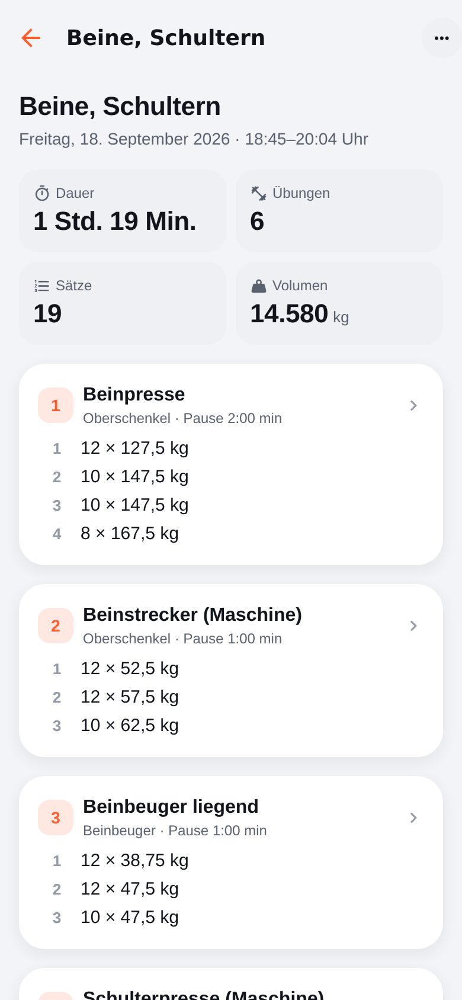

Formkurve erkennt beim Abhaken automatisch neue persönliche Rekorde und zeigt einen 🏆-Hinweis:

- **Höchstes Gewicht** (bei mindestens einer Wiederholung),
- **Bestes geschätztes 1RM** (mehr Wiederholungen mit gleichem Gewicht zählen auch),
- **Meiste Wiederholungen** bei Übungen ohne Gewicht,
- **Längste Dauer** bei Zeitübungen.

Das allererste Training einer Übung zählt nicht als Rekord – es gibt ja noch nichts zu schlagen. Aufwärmsätze werden nie
gewertet. Wie das 1RM geschätzt wird, steht in [Berechnungen](berechnungen.md#geschätztes-1rm-epley).

 

### 3.7 Pläne

Ein Plan ist eine Vorlage für ein Training, z. B. „Brust, Bizeps, Bauch“.

- **Neuer Plan** (Training-Tab) → Name eingeben → **Übungen hinzufügen**. Pro Übung legst du Anzahl der Sätze, optional
  Zielwerte, Pausenzeit und Seiten (links/rechts) fest.
- Schneller geht es nach einem Training: **Als Plan speichern** übernimmt Übungen und Sätze.
- Das Menü **⋯** eines Plans bietet: Training starten, Bearbeiten, Duplizieren und Löschen.

Beim Starten eines Plans werden als Vorschlag die Werte vom letzten Mal angezeigt – so siehst du immer deinen aktuellen
Stand. Nur wenn es für einen Satz noch keine gibt, werden die Zielwerte aus dem Plan verwendet.

### 3.8 Verlauf und Trainings bearbeiten

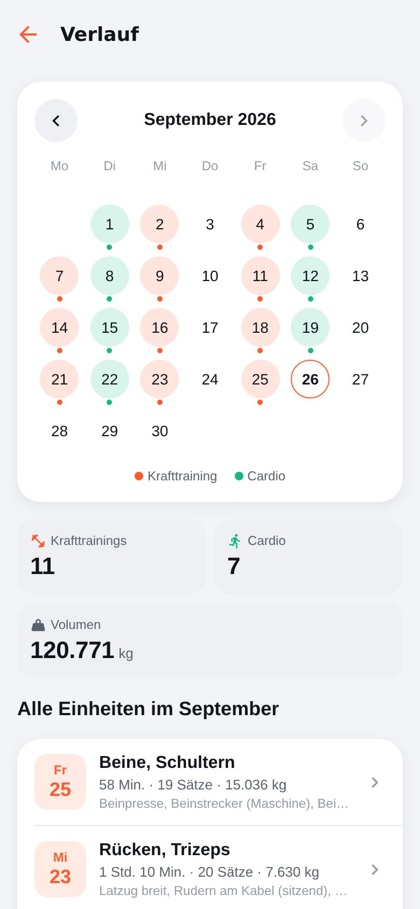

**Training → Verlauf → Alle anzeigen** zeigt einen Monatskalender, in dem Kraft- und Cardiotage markiert sind, dazu die
Monatsstatistik und alle Einheiten des Monats. Ein Tipp auf einen Tag filtert die Liste. Ein Tipp auf ein Training öffnet
die Details mit allen Sätzen, Volumen und Rekorden. Über das Menü **⋯**:

- **Bearbeiten** – Sätze, Übungen, Datum und Dauer nachträglich ändern,
- **Erneut trainieren** – startet ein neues Training mit denselben Übungen,
- **Als Plan speichern**, **Als Text teilen**, **Text kopieren**,
- **Löschen**.

Ein vergessenes Training trägst du nach, indem du ein leeres Training startest, oben Datum und Beginn änderst und die
Sätze abhakst.

 

### 3.9 Übungsbibliothek und eigene Übungen

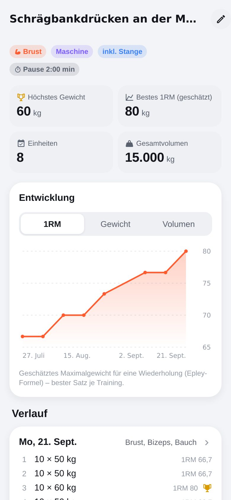

Die Bibliothek (**Profil → Übungsbibliothek** oder beim Hinzufügen einer Übung) enthält 92 Übungen, sortiert nach
Muskelgruppen und mit den Namen, die an Studiogeräten üblich sind. Suche und Filter nach Muskelgruppe helfen beim
Finden; „Zuletzt“ zeigt die zuletzt trainierten Übungen.

Ein Tipp auf eine Übung zeigt ihre **Entwicklung** (Diagramm für 1RM, Gewicht oder Volumen), Bestwerte und alle
bisherigen Einheiten.

**Eigene Übung anlegen** („Übung anlegen“ in der Bibliothek oder direkt aus der Suche):

| Einstellung       | Bedeutung                                                                                  |
| ----------------- | ------------------------------------------------------------------------------------------ |
| Muskelgruppe      | primäre Muskelgruppe (für Titel, Statistik „Sätze pro Muskelgruppe“)                       |
| Gerät             | Maschine, Kabelzug, Langhantel, Kurzhantel, Multipresse, Körpergewicht …                   |
| Erfassung         | **kg × Wdh.**, **Nur Wdh.** (z. B. Klimmzüge, Dipbarren) oder **Zeit** (z. B. Plank)       |
| Gewichtsangabe    | **Gesamtgewicht** oder **Pro Seite** (z. B. Scheiben pro Seite, Kabel pro Seite)           |
| Stange            | **Keine**, **Inkl. Stange** oder **Exkl. Stange** – bei „exkl.“ mit dem Gewicht der Stange |
| Einseitig         | Sätze werden für links und rechts getrennt erfasst                                         |
| Pausenzeit        | Standard-Pause für den Timer                                                               |
| Alternative Namen | weitere Schreibweisen, die der Notizen-Import dieser Übung zuordnen soll                   |

Eingebaute Übungen lassen sich ebenfalls anpassen (z. B. Pausenzeit oder „pro Seite“).

 

## 4. Notizen importieren

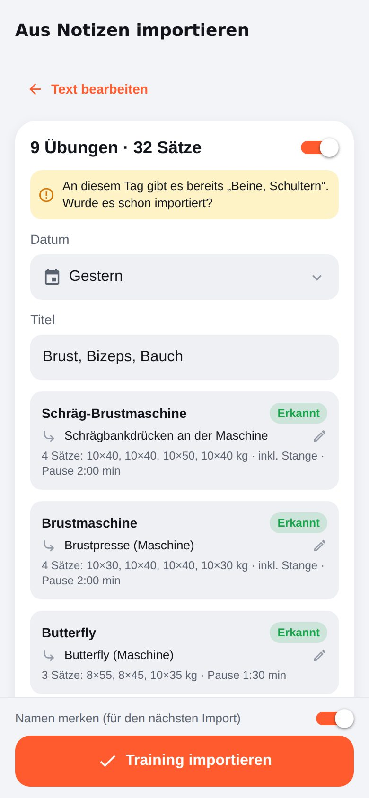

Mit dem Import übernimmst du deine bisherigen Trainings aus der Notizen-App:

1. Text in der Notizen-App markieren und kopieren – gerne mehrere Trainings auf einmal.
2. **Training → Aus Notizen importieren** (auch unter Profil → Daten) öffnen und **Einfügen** tippen.
3. **Weiter zur Vorschau**: Für jedes erkannte Training siehst du Datum, Titel und alle Übungen.
   - **Erkannt** – die Übung wurde einer Übung aus der Bibliothek zugeordnet. Mit dem Stift kannst du die Zuordnung
     ändern.
   - **Neu** – es wird eine eigene Übung angelegt; Muskelgruppe und Gerät werden aus dem Namen geschätzt und sind
     änderbar.
   - Gibt es am selben Tag schon ein Training mit demselben Titel, wird es zunächst abgewählt, damit nichts doppelt
     importiert wird. Mit dem Schalter kannst du jedes Training ein- oder ausschließen.
   - Zeilen, die nicht verstanden wurden, werden unten aufgelistet.
4. **Training importieren**. Mit „Namen merken“ werden deine Schreibweisen als alternative Namen gespeichert – beim
   nächsten Import werden sie sofort erkannt.

Welche Schreibweisen unterstützt werden, beschreibt [Notizen-Import](notizen-import.md) ausführlich.

 

## 5. Körpergewicht und Körpermaße

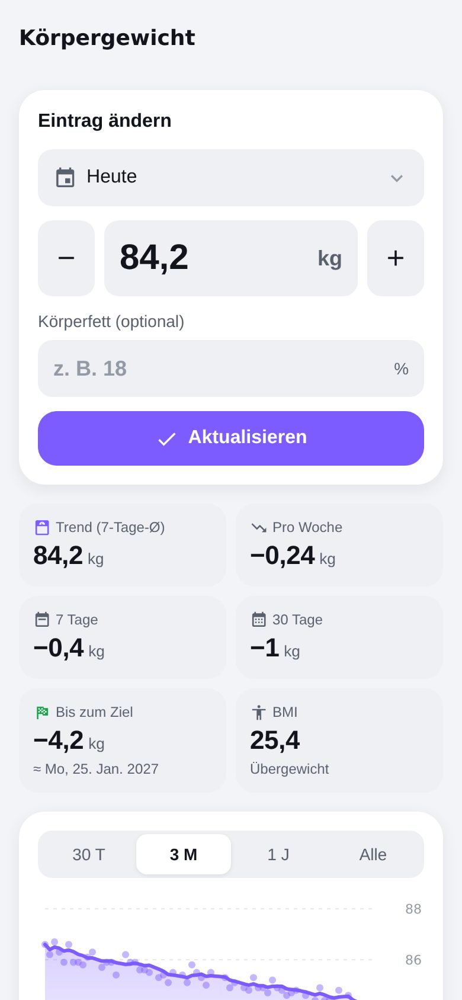

**Gewicht eintragen**: über die Schnellaktion auf „Heute“ oder **Fortschritt → Körper**. Pro Tag gibt es einen Eintrag;
ein erneuter Eintrag am selben Tag überschreibt den alten. Optional kannst du den Körperfettanteil speichern. Unter
„Einträge“ öffnet ein Tipp einen alten Wert zum Ändern, langes Drücken löscht ihn.

Die Gewichtsseite zeigt:

- **Trend (7-Tage-Ø)** – der Durchschnitt der letzten sieben Tage glättet normale Schwankungen durch Wasser, Salz und
  Essen. Achte auf den Trend, nicht auf einzelne Tage.
- **Pro Woche** – durchschnittliche Veränderung der letzten vier Wochen.
- **7 Tage / 30 Tage** – Veränderung des Trends.
- **Bis zum Ziel** – verbleibende Kilos und ein geschätztes Datum, wann du das Zielgewicht erreichst.
- **BMI** mit Einordnung.

**Tipp:** Wiege dich möglichst immer unter gleichen Bedingungen – morgens nach dem Aufstehen, vor dem Frühstück. Die
tägliche Erinnerung stellst du unter **Profil → Erinnerungen → Täglich wiegen** ein.

**Körpermaße** (Fortschritt → Körper → Körpermaße → Eintragen): Hals, Schultern, Brust, Taille, Bauch (Nabelhöhe),
Hüfte, Oberarme, Oberschenkel und Waden jeweils links/rechts. Es müssen nicht alle Felder ausgefüllt werden.

 

## 6. Cardio

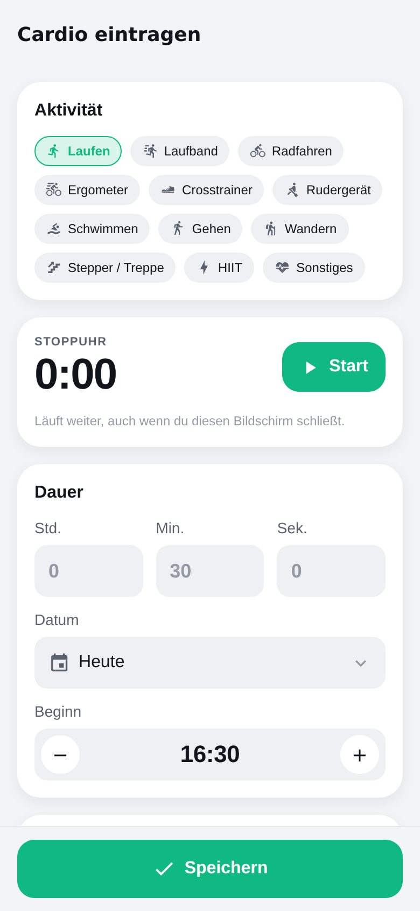

**Cardio eintragen** (Heute → Cardio oder Training-Tab):

1. Aktivität wählen: Laufen, Laufband, Radfahren, Ergometer, Crosstrainer, Rudergerät, Schwimmen, Gehen, Wandern,
   Stepper/Treppe, HIIT oder Sonstiges.
2. Dauer mit der **Stoppuhr** messen („Zeit übernehmen“) oder direkt eingeben.
3. Optional Distanz, Kalorien und Durchschnittspuls ergänzen.

Aus Distanz und Dauer berechnet die App **Tempo** (min/km) und **Geschwindigkeit** (km/h). Lässt du das Kalorienfeld
leer, wird der Verbrauch aus Aktivität, Tempo und deinem Gewicht **geschätzt** (siehe
[Berechnungen](berechnungen.md#kalorienverbrauch-beim-cardio)). Zeigt dein Gerät oder deine Uhr einen Wert an, trag
lieber diesen ein.

 

## 7. Ernährung und Wasser

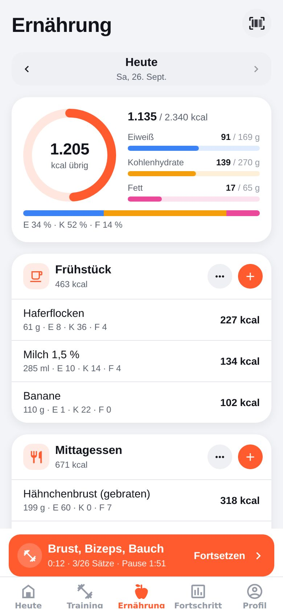

Der Tab **Ernährung** ist dein Tagebuch. Oben wählst du den Tag, darunter siehst du Kalorien und Makros (Eiweiß,
Kohlenhydrate, Fett) im Vergleich zum Ziel, dann die Mahlzeiten Frühstück, Mittagessen, Abendessen und Snacks.

**Essen hinzufügen** (⊕ bei einer Mahlzeit):

- **Suchen** in den 123 eingebauten Grundlebensmitteln sowie deinen eigenen und gescannten Produkten. Die Reiter
  „Zuletzt“, „Favoriten“ und „Eigene & Gescannte“ sparen Tipparbeit. Ist ein Markenprodukt nicht dabei, sucht
  **„Online suchen“** in der freien Datenbank Open Food Facts (Internet nötig).
- **Scannen** – Barcode eines Produkts scannen. Die Nährwerte kommen aus der freien Datenbank Open Food Facts (Internet
  nötig) und werden danach lokal gespeichert – beim nächsten Mal klappt es auch offline. Wird ein Produkt nicht
  gefunden, kannst du es selbst anlegen. Ohne Kamera lässt sich der Barcode auch eintippen.
- **Schnell** – nur Bezeichnung und Kalorien (und optional Makros) eintragen, z. B. „Döner, 650 kcal“.
- **Eigenes** – eigenes Lebensmittel mit Nährwerten pro 100 g bzw. 100 ml und optionaler Portionsgröße anlegen.

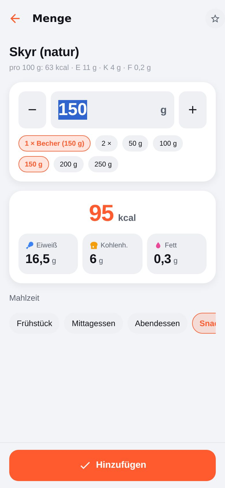

Nach der Auswahl gibst du die **Menge** in Gramm/Milliliter ein oder wählst eine Portion (z. B. „1 Scheibe“,
„1 Portion“). Die Nährwerte werden sofort berechnet. Mit dem Stern markierst du Favoriten.

Ein Tipp auf einen Eintrag im Tagebuch öffnet ihn zum Ändern oder Löschen. Das Menü **⋯** einer Mahlzeit bietet
außerdem „Barcode scannen“, „Kalorien schnell eintragen“ und **„Von gestern übernehmen“** – praktisch, wenn du oft
dasselbe frühstückst.

**Wasser**: Auf der Ernährungsseite und auf „Heute“ fügst du mit einem Tipp 250 ml oder 500 ml hinzu. Das Tagesziel
wird beim Einrichten aus deinem Gewicht vorgeschlagen (etwa 35 ml pro kg) und ist unter **Profil → Ziele → Wasser**
änderbar.

**Kalorien- und Makroziele** werden automatisch aus Profil, Aktivität, Ziel und aktuellem Gewicht berechnet und bei
neuen Gewichtseinträgen angepasst. Unter **Profil → Ziele → Kalorien & Makros** kannst du sie auch manuell festlegen.

 

## 8. Fortschritt

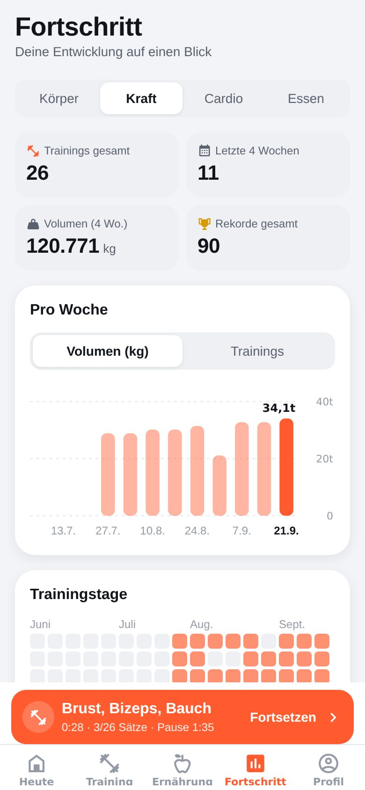

Der Tab **Fortschritt** hat vier Bereiche:

| Bereich    | Inhalt                                                                                                                                            |
| ---------- | ------------------------------------------------------------------------------------------------------------------------------------------------- |
| **Körper** | Gewichtsverlauf mit Trendlinie und Zielgewicht (30 Tage, 3 Monate, 1 Jahr, alles), Kennzahlen, Körpermaße mit Veränderung seit der ersten Messung |
| **Kraft**  | Volumen bzw. Anzahl Trainings pro Woche, Trainingstage-Kalender, Sätze pro Muskelgruppe (letzte 30 Tage), neueste Rekorde, deine Übungen          |
| **Cardio** | Minuten pro Woche, Kennzahlen der letzten 90 Tage und Aufteilung nach Aktivität                                                                   |
| **Essen**  | Kalorien der letzten 14 Tage mit Ziellinie, Durchschnitt von Kalorien, Eiweiß, Wasser und Makros, Tage im Zielbereich                             |

**Sätze pro Muskelgruppe** hilft, ein ausgewogenes Training zu planen: Siehst du dort z. B. viel Brust, aber wenig
Beinbeuger, weißt du, worauf du achten solltest.

 

## 9. Profil und Einstellungen

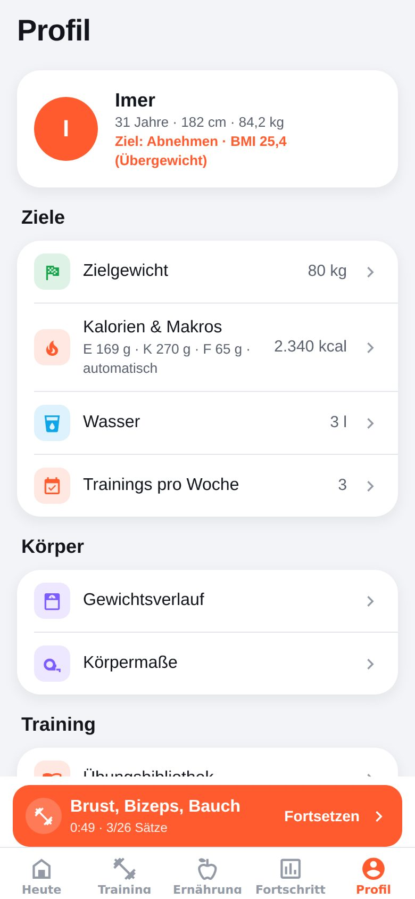

| Bereich          | Einstellungen                                                                                                                                                  |
| ---------------- | -------------------------------------------------------------------------------------------------------------------------------------------------------------- |
| **Profil**       | Name, Geschlecht, Geburtsjahr, Größe, Aktivität, Ziel (Tipp auf die Profilkarte)                                                                               |
| **Ziele**        | Zielgewicht, Kalorien & Makros (automatisch oder manuell), Wasser pro Tag, Trainings pro Woche                                                                 |
| **Körper**       | Gewichtsverlauf, Körpermaße                                                                                                                                    |
| **Training**     | Übungsbibliothek, Standard-Pausenzeit, Gewichtsschritte für Steigerungs-Tipps (z. B. 2,5 kg), Bildschirm aktiv halten, Vibration und Mitteilung bei Pausenende |
| **Erinnerungen** | tägliche Erinnerung zum Wiegen mit Uhrzeit                                                                                                                     |
| **Werkzeuge**    | 1RM-Rechner, Scheibenrechner                                                                                                                                   |
| **Darstellung**  | Hell, Dunkel oder wie das System                                                                                                                               |
| **Daten**        | Notizen importieren; Backup, Export & Wiederherstellung                                                                                                        |

 

## 10. Werkzeuge

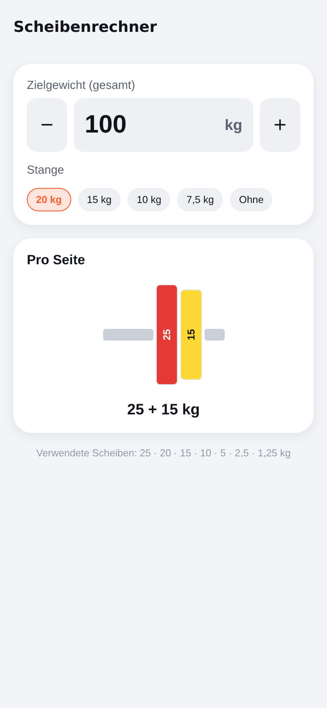

**1RM-Rechner** – Gewicht und Wiederholungen eines Satzes eingeben; die App schätzt dein Maximalgewicht für eine
Wiederholung und zeigt eine Tabelle mit Trainingsgewichten von 100 % bis 50 % samt passender Wiederholungszahl.

**Scheibenrechner** – Zielgewicht eingeben und die Stange wählen (20, 15, 10 oder 7,5 kg bzw. ohne); die App zeigt,
welche Scheiben pro Seite aufgelegt werden müssen. Lässt sich das Gewicht nicht exakt erreichen, wird der
Rest angezeigt.

 

## 11. Daten sichern, exportieren und löschen

Unter **Profil → Backup, Export & Wiederherstellung**:

- **Backup exportieren** – alle Daten (Trainings, Pläne, Übungen, Gewicht, Maße, Cardio, Ernährung, Einstellungen) als
  JSON-Datei. Über das Teilen-Menü kannst du sie z. B. in iCloud Drive, Google Drive oder per Mail sichern.
- **Backup wiederherstellen** – eine Backup-Datei auswählen. **Achtung:** ersetzt alle aktuellen Daten.
- **Export als CSV (Excel)** – Trainings & Sätze, Körpergewicht, Ernährungstagebuch oder Cardio als Tabelle.
- **Alle Daten löschen** – setzt die App vollständig zurück (Sicherheitsabfrage).

Da alle Daten nur auf dem Handy gespeichert sind, empfiehlt sich regelmäßig ein Backup – spätestens vor einem
Handywechsel.

## 12. Tipps und häufige Fragen

**Brauche ich Internet?**
Nein. Nur der Barcode-Scanner und „Online suchen“ fragen Produktdaten bei Open Food Facts ab. Alles andere funktioniert
offline – einmal gefundene Produkte ebenfalls.

**Ich habe vergessen, Sätze abzuhaken – sind sie weg?**
Nein. Beim Beenden fragt die App, ob eingetragene, aber nicht abgehakte Sätze mitgespeichert werden sollen. Trainings
lassen sich außerdem jederzeit bearbeiten.

**Die App wurde während des Trainings geschlossen.**
Das laufende Training wird laufend gespeichert und beim nächsten Öffnen fortgesetzt.

**Wie trage ich „12x12,5kg pro Seite exkl. Stange“ ein?**
Stelle die Übung auf „Pro Seite“ und „Exkl. Stange“ (mit Gewicht der Stange) – beim Notizen-Import passiert das
automatisch. Eingetragen wird dann einfach 12,5 kg, das Volumen rechnet die App mit (12,5 × 2 + Stange) × 12.

**Warum schwankt mein Gewicht so stark?**
Das ist normal: Wasser, Salz, Kohlenhydrate und Verdauung verändern das Gewicht täglich um 1–2 kg. Aussagekräftig ist
der 7-Tage-Trend.

**Wo sehe ich meine Rekorde?**
In der Zusammenfassung nach dem Training, in den Trainingsdetails, bei jeder Übung (Bestwerte) und unter
Fortschritt → Kraft → Neueste Rekorde.

**Kann ich mehrere Geräte synchronisieren?**
Derzeit nicht – die Daten liegen bewusst nur lokal. Über Backup und Wiederherstellung kannst du sie auf ein neues Gerät
übertragen.
